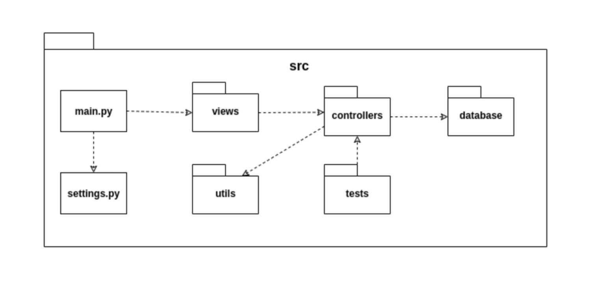

# Arquitetura

## 1. Introdução

### 1.1. Finalidade

Este documento tem como objetivo fornecer uma visão geral da arquitetura do aplicativo SwiftPix. Visa apresentar de forma clara o fluxo de dados, o comportamento da aplicação e como as partes se relacionam, bem como expor de maneira objetiva as decisões arquiteturais que foram tomadas em relação ao projeto.

### 1.2. Escopo

Este documento de arquitetura se aplica ao SwiftPix. Estão descritos neste documento os padrões de arquitetura adotados, frameworks e linguagens escolhidas.

### 1.3. Definições, Acrônimos e Abreviações

* **API** - *Application Programming Interface*: conjunto de rotinas e padrões de programação que viabiliza a comunicação entre dois sistemas ou plataformas distintas.
* **HTTP** - *Hypertext Transfer Protocol*: protocolo de transferência e comunicação de dados.
* **Backend** - Parte da aplicação responsável pela conexão com o banco de dados e gerência das informações que serão enviadas ao frontend.
* **Frontend** - Parte da aplicação responsável pela interação com o usuário, utilizando recursos consumidos do backend.
* **SSP** - Secretaria de Estado de Segurança Pública.
* **SQL** - *Structured Query Language*: Linguagem declarativa de busca para bancos de dados relacionais.
* **JSON** - JavaScript Object Notation
* **REST** - Representational State Sransfer

## 2. Representação Geral da Arquitetura

A aplicação tem um cliente de frontend mobile feito em React Native e três microserviços em seu backend.
Um dos microserviços é o User Service, uma API REST desenvolvida em Flask, que trata todos os dados dos usuários,enviando-os para serem armazenados em um banco de dados não-relacional, MongoDB.

O segundo microserviço é o Transference Service que realiza as transações via PIX, faz consulta de saldo e gera comprovante de transferência, também salva os dados no mongoDB.

O terceiro microserviço é o Geoloc Service é uma API de geolocalização para identificar qual o ip do usuário afim de fazer a transferência para a moeda do país em que a pessoa está realizando o PIX.

As comunicações entre todos os componentes são feitas com o protocolo HTTP e o tipo de conteúdo transmitido dentro do sistema é documento JSON.

## 3. Tecnologias
O diagrama abaixo mostra quais são as tecnologias usadas em cada parte do sistema. Em seguida, essas tecnologias são descritas brevemente.

### 3.1. Flask
[Flask](https://flask.palletsprojects.com/en/1.1.x/#) é um microframework de aplicativos web em Python. Foi designado para se ter um início de desenvolvimento simples, com a habilidade de escalar para aplicações complexas. Flask oferece sugestões, mas não força dependências e layouts ao projeto.

### 3.3. MongoDB
[MongoDB](https://www.mongodb.com/) é um banco de dados orientado a documentos não relacional caracterizado como NoSQL. Ele possui uma maior versatilidade para armazenar os dados. Ele é usado no Secretary Service para armazenar os dados obtidos das SSPs, cuja modelagem pode variar entre as secretarias.

### 3.4. React Native
[React Native](https://reactnative.dev/) é um framework em JavaScript para desenvolver aplicações nativas tanto para Android como para IOS. É baseada em React, uma biblioteca do Facebook criada para desenvolver interfaces de usuário, porém em vez de adaptar o código para browsers, ele adapta para dispositivos móveis.

## 4. Requisitos e Restrições de Arquitetura

* Aplicação deve ser construída baseada na arquitetura de microsserviços, na qual o backend será desenvolvido em Flask e o frontend em React Native.

* O aplicativo será funcional em celulares com o sistema operacional Android e acesso à loja de aplicativos Play Store.

* O celular necessita de conexão estável de internet para uso completo e atualizado do aplicativo.

* O geoloc-service deve ser desenvolvida para consumir dados do site do BACEN.

### 5.1. User-Service

Este serviço tem como base o conjunto de princípios do padrão [REST](https://restfulapi.net/). Ele possui três camadas (View, Controller e Database) com funções e responsabilidades bem estabelecidas, o que permite uma estruturação do serviço que facilita a delegação de tarefas, a manutenção e a evolução. Em sua implementação, os seguintes módulos são usados:

* **src/** - Diretório que contém todo o código fonte da API.
* **main.py** - Arquivo que tem a responsabilidade de inicializar o serviço. Nele é criada a instância da aplicação utilizada para sua execução através do uso das configurações já estabelecidas, e também é realizado o registro das rotas (blueprints) criadas nas views.
* **settings.py** - Arquivo que contém todas as configurações do servidor e de log.
* **views/** - Diretório que implementa as views que são as portas de entrada e saída do serviço, nele são definidos os endpoints e quais métodos HTTP são utilizados.
* **controllers/** - Diretório que implementa as controllers do serviço para itermediar a comunicação entre as camadas de database e a de view. As controllers são responsáveis pela validação dos dados de entrada e demais regras de negócio.
* **utils/** - Diretório onde se encontram os utilitários do projeto, como arquivos para formatação e validação de dados, além da declaração de constantes utilizadas no código.
* **tests/** - Contém os testes unitários realizados sobre as funcionalidades das controllers.

O diagrama abaixo demonstra a interação entre as partes do serviço:

### 5. Frontend

O frontend está sendo implementado com uma organização em que cada módulo possui responsabilidades bem definidas, facilitando assim a manutenção e evolução do código:

* **App.tsx** - Arquivo que chama o componente principal do app que são as rotas.
* **src/** - Diretório que contém basicamente todo o código fonte.
* **routes.tsx** - Arquivo responsável por carregar todas as telas. Para isso ele utiliza os módulos de navigation e de screens.
* **navigation/** - Diretório que controla o fluxo de navegação entre as telas através *tab bottom bar*. Então ele faz uso do componente de screens.
* **screens/** - Contêm as telas da aplicação. Para que as telas funcionem corretamente, esse módulo utiliza os diretórios de services, de componentes e o de utils.
* **services/** - Diretório que contém os endpoints necessários para realizar as requisões feitas no app.
* **components/** - Inclue os componentes que são comuns às telas da aplicação. Os componentes podem ser modals, inputs de formulários, botões, etc.
* **utils/** - Armazena funções utilitárias reutilizáveis que serão disponibilizadas para todo o frontend. 
* **hooks/** - Diretório onde estão os gerenciandores de estado do usuário
* **@types/** - Onde ficam algumas tipagens internas customizadas 

### 6. Transference e Geoloc

Estes serviços possuem os mesmos princípios do User-Service, porém o Geoloc, além  da API ele tem um módulo de crawler para o site do BACEN. Na API as camadas são as mesmas do User-Service, mas com menos responsabilidades por ser mais simples.

* **src/** - Diretório que contém todo o código fonte da API.
* **main.py** - Arquivo que tem a responsabilidade de inicializar o serviço. Nele é criada a instância da aplicação utilizada para sua execução através do uso das configurações já estabelecidas, e também é realizado o registro das rotas (blueprints) criadas nas views.
* **settings.py** - Arquivo que contém todas as configurações do servidor e de log.
* **views/** - Diretório que implementa as views que são as portas de entrada e saída do serviço, nele são definidos os endpoints e quais métodos HTTP são utilizados.
* **controllers/** - Diretório que implementa a controller do serviço para itermediar a comunicação entre as camadas de database e a de view. A controllers está sendo responsável pela validação dos filtros e demais regras de negócio.
* **database/** - Diretório responsável pela comunicação com o banco de dados não relacional. Nele é feita a conexão com o banco.
* **utils/** - Diretório onde se encontram os utilitários do projeto, como arquivos para formatação e validação
* **populationData.json** - Arquivo com os dados populacionais usados para calcular a quantidade de crimes *per capita*
* **tests/** - Contém os testes unitários realizados sobre as funcionalidades da controller.
* **crawlers/** - Responsável pela implementação dos crawlers, com Scrapy e eventualmente [Selenium](https://www.selenium.dev/), que realizam a extração metódica e automatizada de dados das SSPs.

O diagrama abaixo demonstra a interação entre as partes do serviço:

## 7. Referências

JUNIOR, Cleber; LUI, Brian; HORINOUCHI, Lucas; SOUZA, Rômulo; HERONILDO, Francisco; TOYOSHIMA, Filipe; ALVES, Vitor; APOLINÁRIO, Jacó. Projeto HubCare: Documento de Arquitetura. Disponível em: https://cjjcastro.gitlab.io/2019-1-hubcare-docs/project/architecture-document/#5-visao-de-implementacao. 
LIMA, Alan; BERNARDO, Elias; MARQUES, Guilherme; BARREIROS, Leonardo; BLANCO, Matheus; FÉO, Pedro; RODRIGUES, Pedro; KADER, Saleh; SILVA, Sara; ALCÂNTARA, Shayane. Projeto QR Comer: Documento de Arquitetura. Disponível em: https://fga-desenho-2019-2.github.io/Wiki/seminario5/arquitetura/. 

MENDES, Iasmin; VALÉRIO, Renato; JOÃO, Lucas; DAVI, Gabriel; SOUZA, Sousa; MACIEL, Lucas; FERNANDES, Weiller; GOMES, Matheus. Projeto Indica AI: Documento de Arquitetura. Disponível em: https://fga-eps-mds.github.io/2018.2-IndicaAi//docs/2018/08/28/architecture-doc.html. 

MIGUEL, Alexandre; ALVES, Davi; GUEDES, Gabriela; GOULART, Helena; ROBSON, João; MENEZES, Leticia; GUILHERME, Luiz; SCHADT, Renan; VINICIUS, Rômulo; HUGO, Victor. Projeto Translate.me: Documento de Arquitetura. Disponível em: https://translate-me.github.io/docs/documentos/projeto/doc_de_arquitetura/. 

## Histórico de Revisão

| Data | Versão| Descrição | Autor |
|----|----|----|----|
| 27/05/2024 | 1.0 | Adicionando Introdução | Júlia Farias Sousa|
