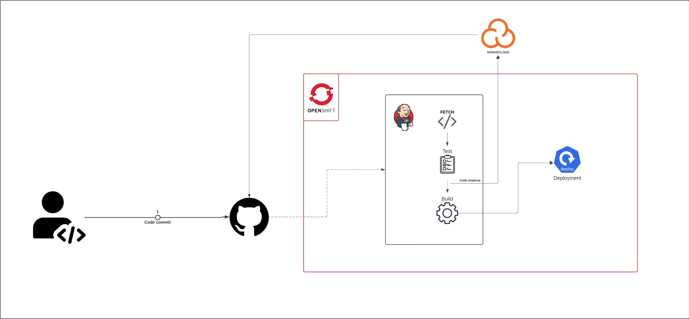

# Documento de Arquitetura DevOps

## 1. Introdução
Este documento tem como principal objetivo fornecer uma visão abrangente e estruturada da arquitetura DevOps. Ele descreve as principais decisões de design, componentes, módulos, interações e estrutura do software.

## 1.1. Visão Geral
Este documento está estruturado da seguinte forma:
- Plano de Arquitetura DevOps
- Estratégia de Implementação DevOps
- Diagrama de Arquitetura DevOps

## 2. Plano de Arquitetura DevOps

## 2.1. Tecnologias
### 2.1.1 GitHub
GitHub é uma plataforma de hospedagem de código para controle de versão e colaboração. Permite que vários desenvolvedores trabalhem juntos em projetos a partir de qualquer lugar.

### 2.1.2 Jenkins
Jenkins é um servidor de automação de código aberto. Utilizado para automatizar diversas fases do processo de desenvolvimento de software como builds, testes e deploy, facilitando a integração contínua e entrega contínua (CI/CD).

### 2.1.3 SonarCloud
SonarCloud é uma plataforma de análise de qualidade de código online. Ajuda a detectar e corrigir problemas de qualidade, vulnerabilidades de segurança e bugs em código-fonte, suportando várias linguagens de programação.

### 2.1.4 RedHat Openshift
RedHat Openshift é uma plataforma de contêineres baseada em Kubernetes que facilita o desenvolvimento, a implantação e a gestão de aplicações em ambientes de nuvem. Oferece automação em larga escala para operações de DevOps, incluindo gerenciamento de infraestrutura e desenvolvimento de aplicações.

A estratégia de implementação DevOps descreve o processo integrado e as práticas que serão adotadas para facilitar a colaboração entre as equipes de desenvolvimento, operações e qualidade. O objetivo é automatizar e otimizar o processo de desenvolvimento de software, garantindo entregas mais rápidas e seguras.

## 3. Estratégia de Implementação DevOps

A estratégia de implementação DevOps descreve o processo integrado e as práticas que serão adotadas para facilitar a colaboração entre as equipes de desenvolvimento, operações e qualidade. O objetivo é automatizar e otimizar o processo de desenvolvimento de software, garantindo entregas mais rápidas e seguras.

### 3.1. Integração Contínua (CI)

1. **Controle de Versão:** Todo código-fonte e artefatos de configuração são mantidos no GitHub.
2. **Build Automatizado:** Ao realizar um push para o repositório no GitHub, o Jenkins é acionado automaticamente para executar builds do projeto.
3. **Testes Automatizados:** Durante o processo de build, o Jenkins executa uma série de testes automatizados para garantir a qualidade do código.
4. **Análise de Qualidade do Código:** Após os testes, o SonarCloud realiza uma análise detalhada do código para detectar problemas de qualidade e segurança.

### 3.2. Entrega Contínua (CD)

1. **Preparação de Ambiente:** Utilizando o RedHat Openshift, ambientes são preparados e gerenciados  entre os ambientes de desenvolvimento, teste e produção.
2. **Deploy Automatizado:** Após a aprovação na fase de CI, o Jenkins automatiza o deploy das aplicações no ambiente.
3. **Monitoramento e Feedback:** Ferramentas de monitoramento são utilizadas para acompanhar o desempenho das aplicações em tempo real. 

## 3. Diagrama de Arquitetura DevOps

Segue o diagrama mostrando como funcionará o sistema, detalhando os fluxos de trabalho entre as ferramentas e os processos adotados para Integração Contínua (CI) e Entrega Contínua (CD).

## 4. Histórico de versão

|**Data**|**Descrição**|**Autore(es)**|
|--------|-------------|--------------|
| 06/05/2023 | Criação do documento | Yuri Alves |
