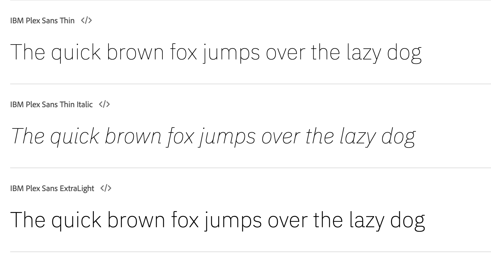

# Guia de estilo

## 1. Introdução

O guia de estilo é um conjunto de diretrizes que estabelece padrões e regras para a escrita e apresentação de design para um produto.
Tem como principal objetivo ajudar a manter a consistência na comunicação visual do projeto, aumentando a sua legibilidade, reconhecimento e memorização pelo público-alvo. Ele pode ser encontrado nesse [link](https://www.figma.com/file/REkcJ97Q6McZkXooyDtgSq/SwiftPIX?type=design&node-id=0%3A1&mode=design&t=rzpLw2fua0RV4k3M-10)

## 2. Logo

## 3. Estrutura dos templates

### 3.1 Tipografia

A principal família tipográfica definida para o projeto é a IBM Plex Sans  e suas variações de estilo.

### 3.2 Cores

### 3.3 Ícones

Os icones utilizados na aplicação são obtidos a partir da biblioteca [material-icons](https://mui.com/pt/material-ui/material-icons/)

## 4. Referências

> [1] Style Guide. Disponivel em: https://aelaschool.com/designvisual/style-guide-como-desenvolver-o-guia-de-estilo-da-sua-interface/

> [2] Material UI. Disponível em: https://mui.com/pt/material-ui

## 5. Histórico da versão

| **Data**   | **Descrição**                       | **Autor(es)**         |
| ---------- | ----------------------------------- | --------------------- |
| 08/05/2024 | Criação do documento guia de estilo | Júlia Farias Sousa |
