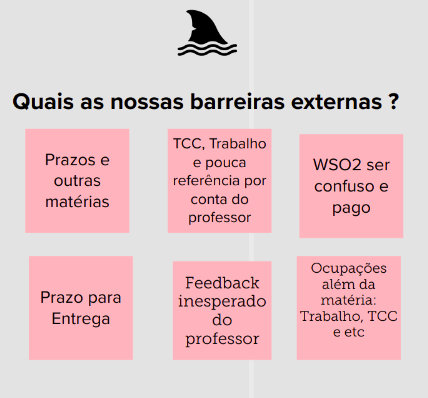
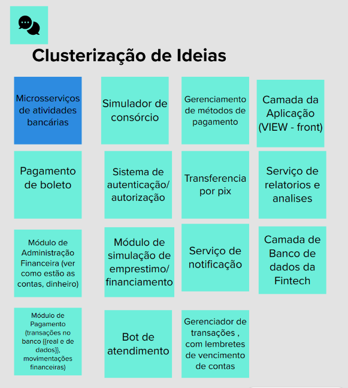

# Dinâmicas
As dinâmicas e CANVAS MVP foi feito com todo o grupo FINTECH, como houve divisão no grupo, haverá algumas funcionalidades que não serão utilizadas. Mantendo na doc apenas para registro.

Antes de começar o Lean Inception e a criação do Canvas MVP, iniciamos por algumas dinâmicas de design thinking,
para facilitar a integração do grupo em início do projeto e acelerar a criação do Canvas MVP.

## Objetivo
Fizemos um levantamento com os membros de qual seria o objetivo do projeto na visão de cada um.

## Pontos Fortes
Os membros citaram quais seriam os pontos fortes que eles viam na equipe e no projeto.

## Barreiras Internas
Foi levantado quais seriam as barreiras internas para cada membro.

## Barreiras Externas
Foi levantado quais seriam as barreiras externas para cada membro.

## Clusterização de ideias
Fizemos um Brainstorm com os membros do grupo para levantar possíveis serviços e/ou microserviços para o nosso projeto.
O resultado desse Brainstorm usamos para definir as personas do Canvas MVP.

### Resultado da Clusterização

## Histórico de versão
| Data | Versão | Descrição | Autor(es) |
| ---- | ---- | ---- | ---- |
| 03/04/2024 | 1.0 | Criação do Documento | Cibele Freitas Goudinho |