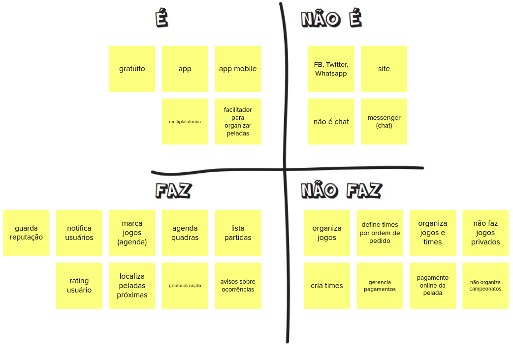
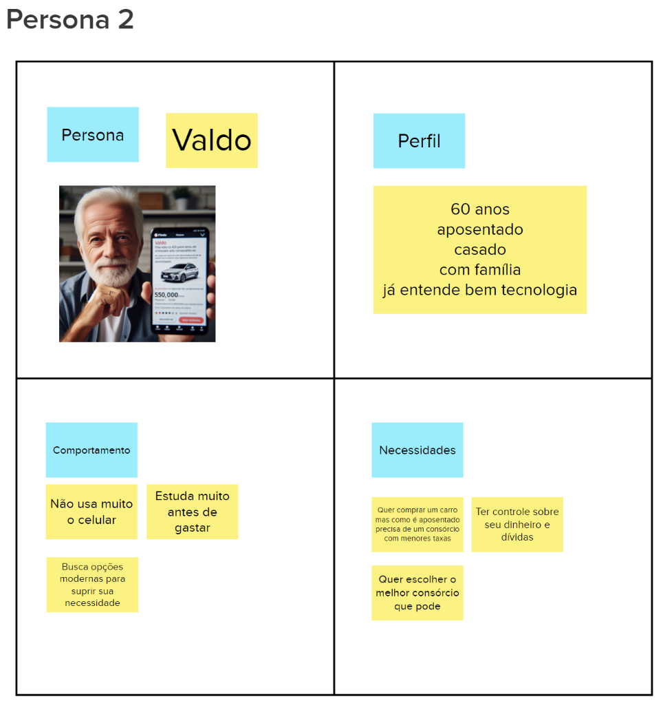
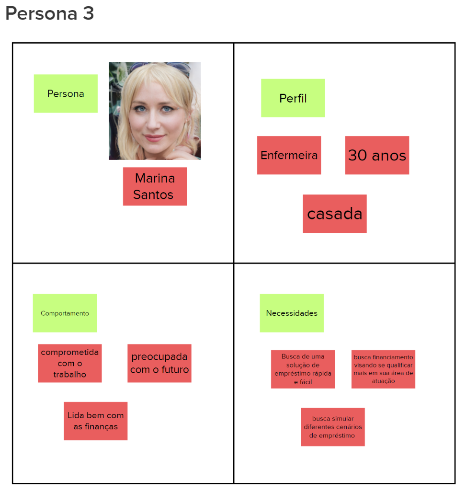
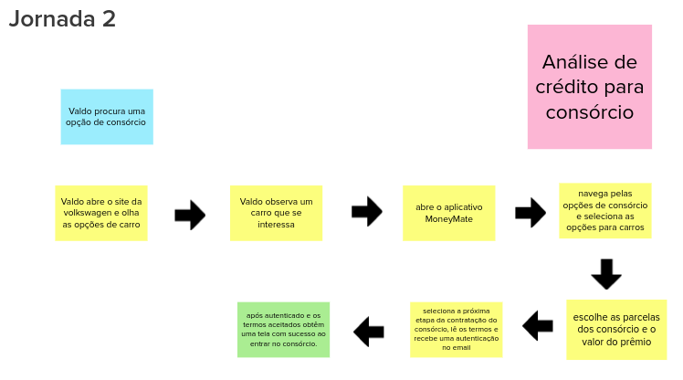
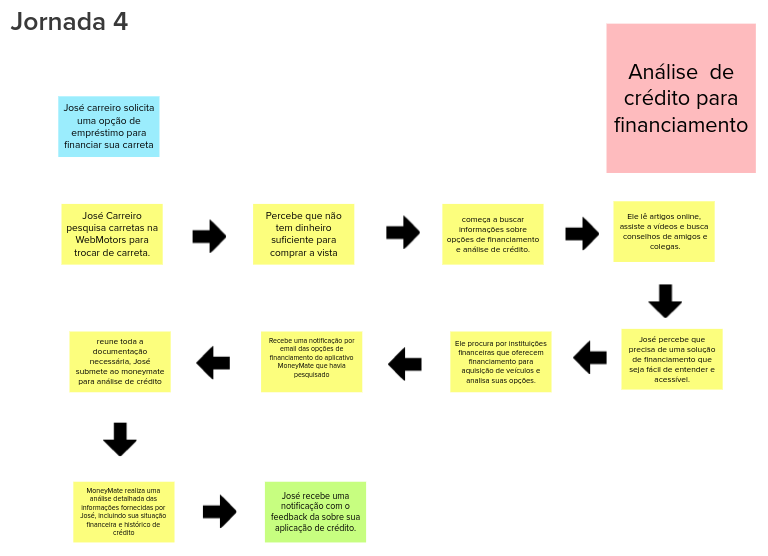
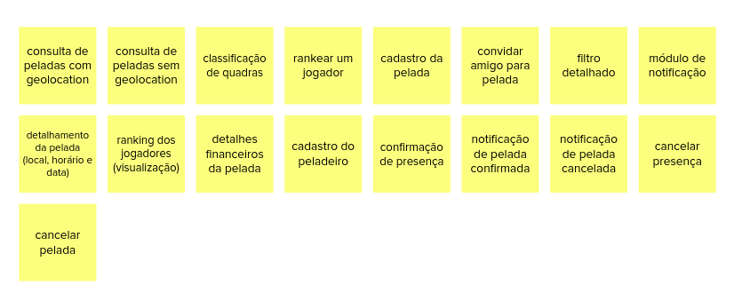
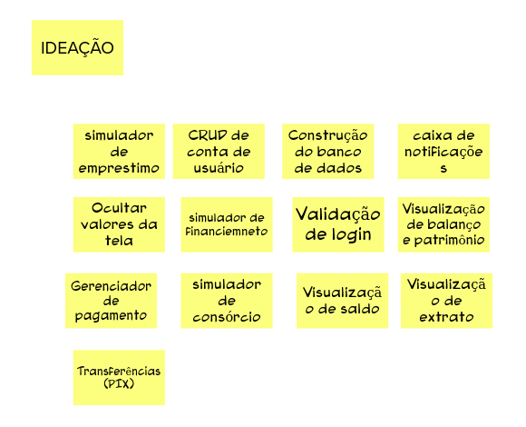
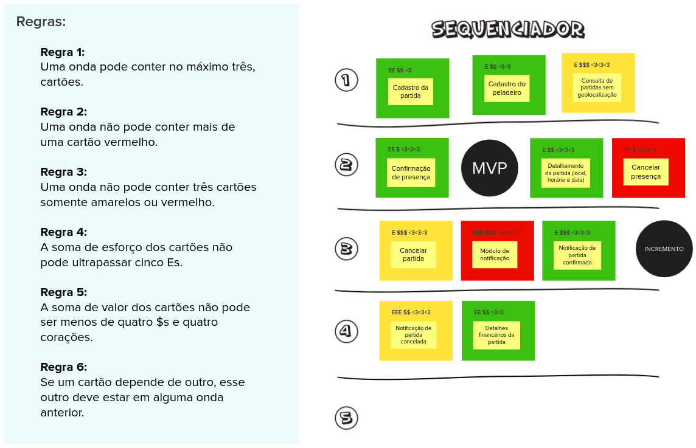

# Lean Inception
As dinâmicas e CANVAS MVP foi feito com todo o grupo FINTECH, como houve divisão no grupo, haverá algumas funcionalidades que não serão utilizadas. Mantendo na doc apenas para registro.

## Introdução:
&emsp;&emsp; Lean Inception é a combinação eficaz do Design thinking e do Lean StartUp para decidir o Produto Mínimo Viável (MVP). Sendo um workshop dividido em várias partes e atividades para auxiliar no entendimento e na construção do produto.

&emsp;&emsp; A princípio fizemos as seguintes dinâmicas no nosso Lean Inception:

- Visão do Produto;
- Produto É, NÁO É, FAZ, NÃO FAZ;
- Objetivos do produto;
- Personas;
- Jornada do Usuário
- Brainstorming de funcionalidades;
- Revisão técnica, de negócio e de UX
- Sequenciador;
- Canvas MVP

### Visão do produto

 &emsp;&emsp; No Lean Inception a visão do produto é essencial para definir o valor do negócio e orientar o desenvolvimento inicial. Ela determina quais características do produto serão priorizadas e a estratégia de posicionamento. A visão deve refletir uma mensagem clara e convincente para os clientes, ajudando a traçar o caminho inicial entre a ideia e o lançamento do produto. Esta atividade é colaborativa e ajuda a estabelecer a essência do valor do negócio.

&emsp;&emsp; A partir desse template é importante seguir um passo a passo para cumprir a atividade:

1. Escreva o template visão do produto em um quadro branco ou flip chart, de forma que seja visível para toda a equipe.
2. Divida a equipe em grupos menores e solicite que cada um deles preencha uma lacuna separadamente (ou mais, dependendo do tamanho da equipe).
3. Reúna o resultado de cada grupo, formando uma única frase.

#### Resultado:

### É Não É, Faz Não faz

&emsp;&emsp; Muitas vezes é mais fácil descrever o que alguma coisa não é ou não faz. A atividade "É - Não é - Faz - Não faz" (ENFN) é uma abordagem que busca classificar aspectos positivos e negativos de um produto, descrevendo o que ele é e faz, assim como o que não é e não faz. Esta abordagem visa fornecer uma compreensão clara e abrangente do produto, identificando suas características e limitações. Para executar a atividade basta executar os seguinte passos:

1. Divida um quadro branco ou flip chart em quatro áreas (É / Não é / Faz / Não faz).
2. Escreva o nome do produto em destaque, acima dos quadrantes.
3. Solicite que cada participante descreva o produto, escrevendo as características em post-its e colocando-os nas áreas devidas.
4. Leia e agrupe as notas afins.

#### Resultado:

### Objetivos do produto:

&emsp;&emsp; Cada integrante da equipe é incentivado a expressar sua compreensão dos objetivos do negócio, enquanto diversos pontos de vista são discutidos para alcançar um consenso sobre as prioridades. Esta atividade visa ajudar na identificação e esclarecimento dos objetivos.

&emsp;&emsp; Passo a passo da atividade:

1. Cada membro da equipe é solicitado a escrever individualmente três respostas para a pergunta:  “Se você tiver que resumir o produto em três objetivos para o negócio, quais seriam eles?”.
2. Os participantes compartilham suas respostas em um quadro comum, agrupando-as por similaridade.
3. A equipe colaborativamente reformula os objetivos. Neste momento, torna-se evidente que alguns elementos listados não são objetivos do produto e podem ser descartados. Isso proporciona clareza sobre o foco do projeto para a equipe.

#### Resultado:

### Personas:

&emsp;&emsp; Para compreender efetivamente as funcionalidades de um produto, é crucial considerar os usuários e seus objetivos. Uma abordagem comum para representar os usuários é através de personas. Uma persona retrata um usuário do produto ou serviço, detalhando não apenas seu papel, mas também suas necessidades particulares. Isso proporciona uma representação realista dos usuários, ajudando a equipe a descrever as funcionalidades do produto sob a perspectiva daqueles que interagirão com ele.

&emsp;&emsp; A seguinte atividade é utilizada para descrever os tipos de personas. Tal atividade é simples, ilustrativa, divertida e rápida.

1. Peça ao time que se divida em duplas ou trios e cada um descreva uma persona.
2. Os participantes do grupo devem apresentar suas personas a todo o time.
3. Opcionalmente peça às pessoas que mudem de grupo e que repitam os passos 1 e 2.

#### Resultado:

### Jornadas do Usuário:
  A jornada descreve o percurso de um usuário por uma sequência de passos para alcançar um objetivo. Alguns destes passos representam diferentes pontos de contato com o produto, caracterizando a interação da pessoa com ele.

  Para descrever a jornada de usuário:

  1. Divida a equipe em três grupos e solicite que cada um deles descreva UMA jornada.
  2. Cada grupo apresenta a sua jornada para toda a equipe.
  3. Opcionalmente, faça mais rodadas para descrever outras jornadas.

#### Resultados:

 

 

 

### Brainstorming de funcionalidades:
  Uma funcionalidade representa uma ação ou interação de um usuário com o produto, por exemplo: imprimir nota fiscal, consultar extrato detalhado e convidar amigos do Facebook. A descrição de uma funcionalidade deve ser o mais simples possível, visando atender um objetivo de negócio, uma necessidade da persona, e/ou contemplando um passo da jornada.

  Para realizar o brainstorming:

  1. Peça que alguém leia, vagarosamente, o passo a passo de uma jornada de usuário.
  2. Durante a leitura, as pessoas compartilham ideias de funcionalidades.
  3. Quando identificada uma funcionalidade, descreva-a e coloque-a no quadro. Repita os passos anteriores para todas as jornadas.

#### Resultados:

### Revisão técnica de negocios e de UX:
Esta revisão tem o objetivo de discutir como a equipe se sente em relação ao entendimento técnico, o de negócio e o de UX para cada funcionalidade. A partir desta atividade, novas notas serão capturadas e as discordâncias e dúvidas ficarão mais aparentes.

1. Peça para uma pessoa escolher e arrastar uma funcionalidade, passando pelo gráfico e tabela.
2. Defina a cor com o nível de confiança e faça as marcações (em uma escala de 1 a 3) de valor de negócio, esforço e valor de UX -- $, E e ♥.
3. Confirme que todos estão de acordo; escolha a próxima pessoa e retorne ao passo 1.

#### Resultados:

### Sequenciador:
  O Sequenciador de funcionalidades auxilia na organização e visualização das funcionalidades e da sequência de validação incremental do produto.

  1. Peça para as pessoas selecionadas decidirem a primeira funcionalidade.
  2. Busque mais cartões, encaixando-os no sequenciador. Respeite as regras.
  3. Identifique o MVP e os incrementos do produto.

#### Resultados:

### Canvas MVP
  O Canvas MVP é um quadro visual que auxilia a equipe a alinhar e definir a estratégia do MVP, a versão mais simples do produto que pode ser disponibilizada para o negócio (produto mínimo) e que possa ser efetivamente utilizado e validado pelo usuário final (produto viável).

  1. Divida a equipe em dois grupos e solicite que cada grupo preencha o Canvas MVP no seu respectivo template.
  2. Peça para cada grupo apresentar o seu Canvas MVP.
  3. Peça para a equipe consolidar os sete blocos do Canvas MVP, utilizando e alterando as anotações anteriores, conforme necessário.

#### Resultados:

## Bibliografia

> CAROLI, P. Lean Inception. [s.l.] Editora Caroli, 2019.

## Histórico de versão
| Data | Versão | Descrição | Autor(es) |
| ---- | ---- | ---- | ---- |
| 03/04/2024 | 1.0 | Criação do Documento | João Henrique |
| 03/04/2024 | 1.1 | Revisão do Documento | Cibele Goudinho |
| 04/04/2024 | 1.2 | Adicionando Jornadas, Brainstorming, Revisão Técnica e Sequenciador | João Henrique |
| 04/04/2024 | 1.3 | Retificando documentação do artefato | João Durso e Paulo Abi  |

