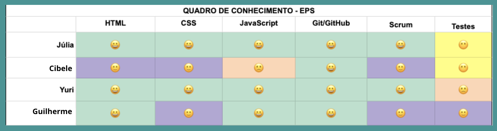

# Quadro de Conhecimento

## Contexto 

Com o intuito de entender qual o domínio dos membros em relação às tecnologias a serem utilizadas, foi criado um quadro de conhecimento, onde os membros indicavam qual o nível de conhecimento nos seguintes assuntos:

- HTML
- CSS
- Javascript
- Git/GitHub
- Scrum
- Testes

Deste modo, é possível entender quais lacunas podem ser preenchidas para um bom desenvolvimento do projeto.

Abaixo, o Quadro de Conhecimento preenchido por cada membro:

## Histórico de versão
| Data | Versão | Descrição | Autor(es) |
| ---- | ---- | ---- | ---- |
| 23/05/2024 | 1.0 | Criação do Documento | Júlia Farias Sousa |