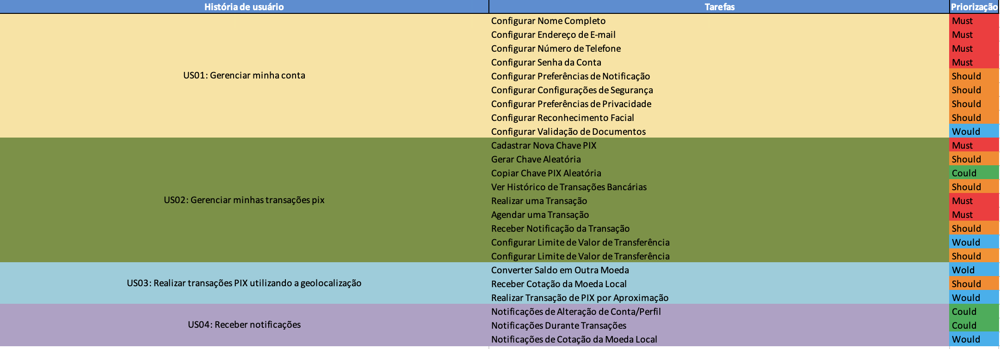

## Backlog do SwiftPix

O backlog de produto apresentado  não apenas reflete uma estratégia de produto bem pensada, mas também destaca a importância de cada funcionalidade para melhorar a experiência do usuário final. A priorização segue uma lógica clara de 'must', 'should', 'could', 'would', facilitando a equipe de desenvolvimento a se concentrar nas funcionalidades mais impactantes primeiro, garantindo assim entregas mais eficazes e alinhadas às necessidades dos usuários.

    US01: Gerenciar Minha Conta
        Prioridades Críticas (Must): A base da funcionalidade do usuário, incluindo configuração de nome completo, e-mail, número de telefone, e senha da conta, são prioritárias. Isso garante que o usuário possa configurar e proteger sua conta de maneira eficiente.
        Alta Prioridade (Should): Preferências de notificação e configurações de segurança, além de reconhecimento facial e validação de documentos, que são importantes para a personalização e segurança da conta do usuário.
        Melhorias Desejáveis (Would): Incluem preferências de privacidade, que, embora importantes, são menos críticas para a funcionalidade básica.

    US02: Gerenciar Minhas Transações PIX
        Prioridades Críticas (Must): Cadastro e cópia de chave PIX são essenciais para o funcionamento do PIX, uma vez que permitem ao usuário realizar transações imediatamente.
        Alta Prioridade (Should): Visualização do histórico de transações e realização de transações são fundamentais para manter o usuário informado e ativo.
        Melhorias Opcionais (Could/Would): Tarefas como converter saldo em outra moeda adicionam valor ao usuário, mas não são essenciais para as funcionalidades básicas.

    US03: Realizar Transações PIX Utilizando a Geolocalização
        Prioridades Variadas: Esta categoria introduz funcionalidades inovadoras como transações PIX por aproximação, mas também inclui tarefas menos críticas como receber notificações de alterações de conta/perfil.

    US04: Receber Notificações
        Prioridades Mistas: Desde receber notificações críticas durante transações até configurações de limites de transferência, que são importantes para o controle do usuário sobre suas finanças.

## Histórico de versão
| Data | Versão | Descrição | Autor(es) |
| ---- | ---- | ---- | ---- |
| 05/07/2024 | 1.0 | Criação do Documento | Júlia Farias Sousa |