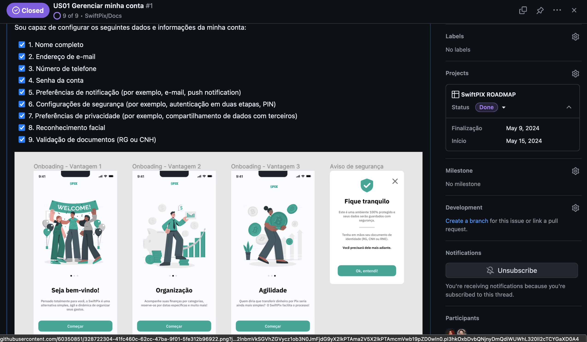

## ROADMAP do SwiftPix

Para organizar melhor o nosso projeto e conseguirmos acompanhar as atividades que cada um está realizando, construímos nosso ROADMAP no Github, abaixo conseguimos ver os principais marcos do projeto, as issues envolvidas assim como os participantes de cada atividade: 

Dentro de cada issue criamos várias atividades a serem cumpridas para ancançar cada história de usuário com êxito. Também acompanha o design de tela relacionado a cada uma das tarefas:

## Histórico de versão
| Data | Versão | Descrição | Autor(es) |
| ---- | ---- | ---- | ---- |
| 17/06/2024 | 1.0 | Criação do Documento | Júlia Farias Sousa |