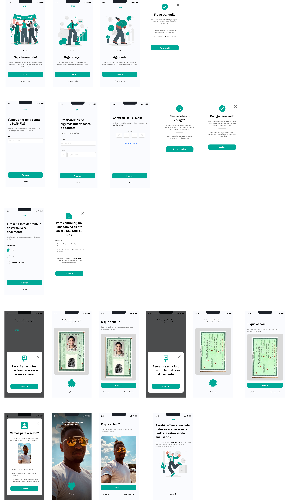

# Protótipo de alta fidelidade

Aqui nos temos o nosso protótipo de alta fidelidade concebido na ferramenta Figma : 

## 1. Link para o Figma 
[link](https://www.figma.com/file/REkcJ97Q6McZkXooyDtgSq/SwiftPIX?type=design&node-id=0%3A1&mode=design&t=rzpLw2fua0RV4k3M-10)

## 2. Demonstração da prototipação 

## 5. Histórico da versão

| **Data**   | **Descrição**                       | **Autor(es)**         |
| ---------- | ----------------------------------- | --------------------- |
| 08/05/2024 | Documentação do Protótipo | Júlia Farias Sousa |